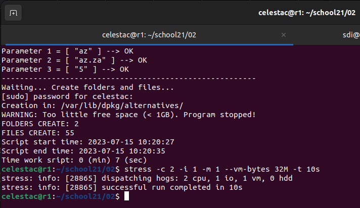
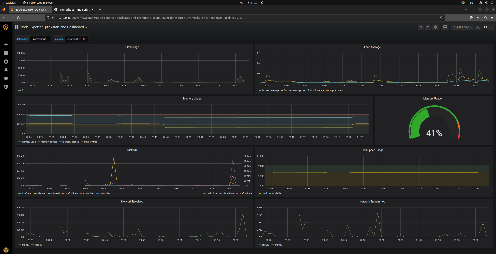
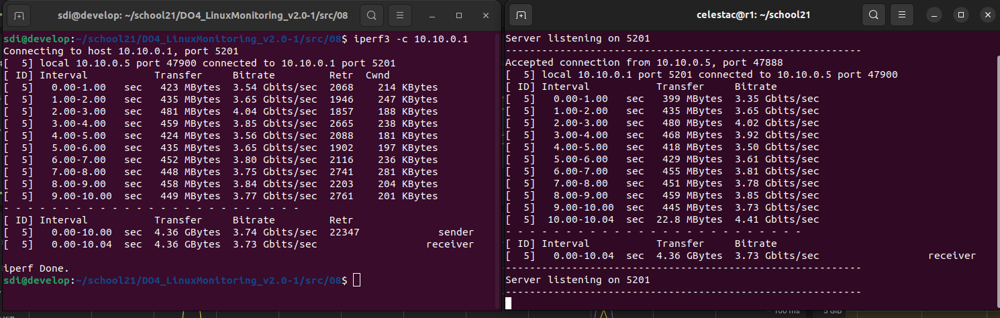
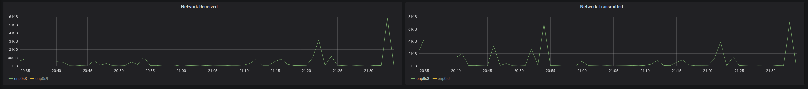
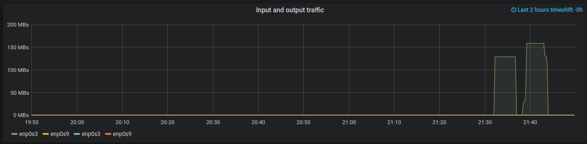

# Part 8. A ready-made dashboard

## Установить готовый дашборд Node Exporter Quickstart and Dashboard с официального сайта Grafana Labs

Скачиваем с официального сайта [Grafana Labs](https://grafana.com/grafana/dashboards/13978-node-exporter-quickstart-and-dashboard/) конфигурационный файл с настройками дашборда, создаем в **Grafana** новый дашборд через импорт конфигурационного файла.

#### 
-------------------------

## Провести те же тесты, что и в Части 7

Запустим скрипт из части 2 и команду `stress -c 2 -i 1 -m 1 --vm-bytes 32M -t 10s`

  

Видим всплески показателей на Дашборде:

  

#### 
-------------------------

## Запустить ещё одну виртуальную машину, находящуюся в одной сети с текущей. Запустить тест нагрузки сети с помощью утилиты iperf3

Запустим на нашей виртуальной машине с **Grafana** команду `iperf3 -s`

Со второй виртуальном машины, находящейся в той же сети запустим команду `iperf3 -c 10.10.0.1`

  

#### 
-------------------------

## Посмотреть на нагрузку сетевого интерфейса

Смотрим на нагрузку сетевого интерфейса и видим всплеск в момент запуска `iperf3`

  

  
