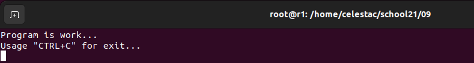
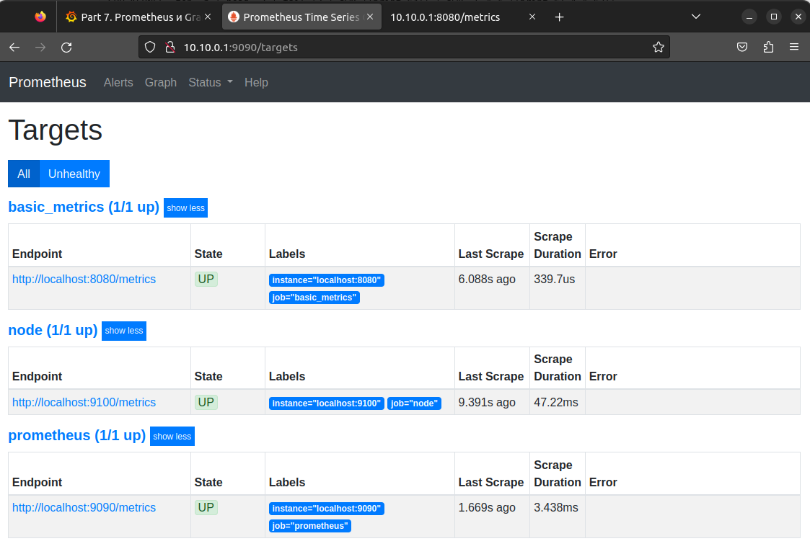
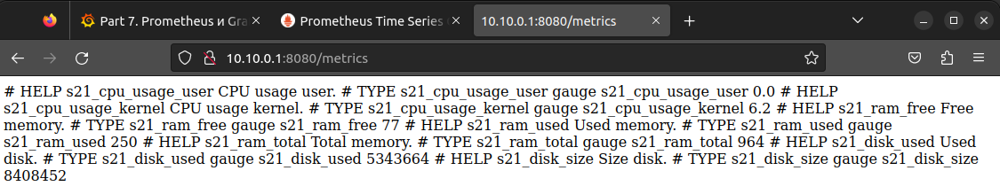
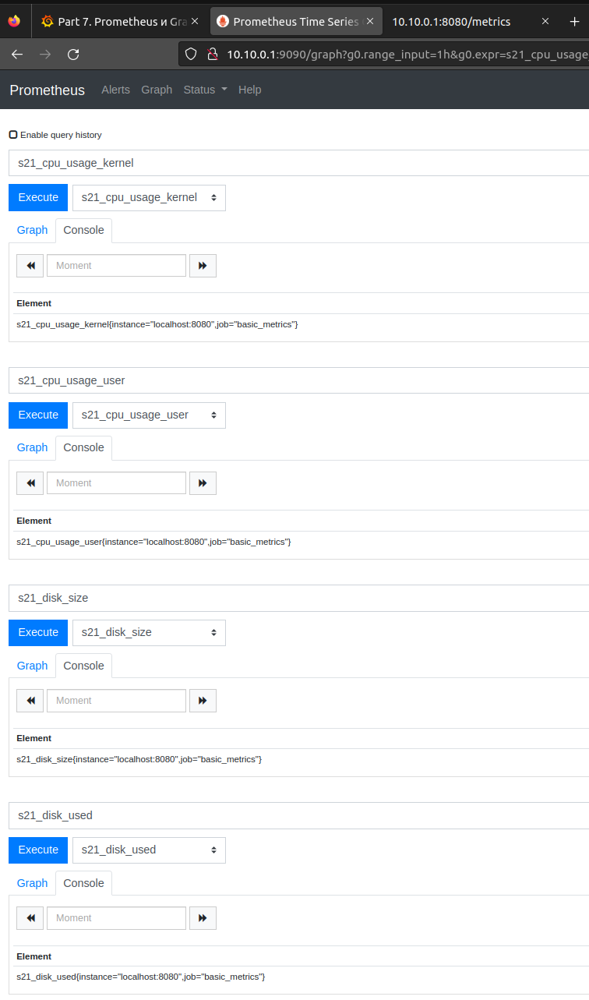
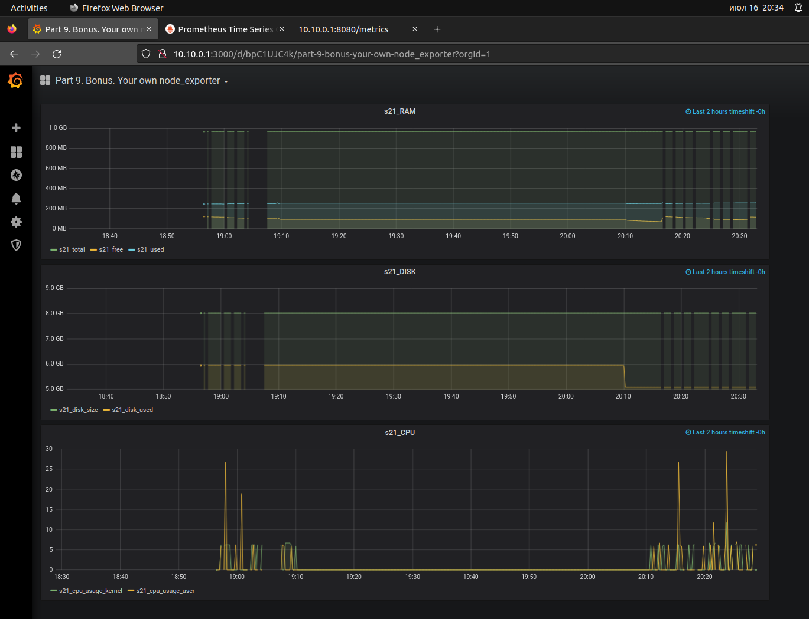
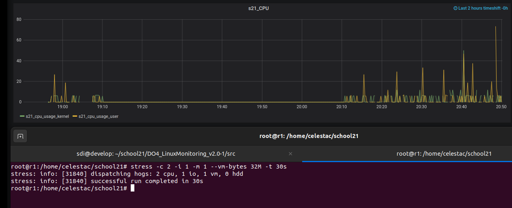

# Part 9. Your own node_exporter


### Написать bash-скрипт, который собирает информацию по базовым метрикам системы (ЦПУ, оперативная память, жесткий диск (объем)). Скрипт или программа должна формировать html страничку по формату Prometheus, которую будет отдавать nginx.  Саму страничку обновлять можно как внутри bash-скрипта или программы (в цикле), так и при помощи утилиты cron, но не чаще, чем раз в 3 секунды.

Запускаем скрипт `./main.sh`. Скрипт установит веб-сервер **nginx** и проведет всю настройку конфигурации.

Код скрипта `main.sh`:
```
#!/bin/bash
clear

if [ -n "$1" ]
  then
      echo "The script: [$0] must be run without parmaters. Try again!"
  else
    ./install.sh
    ./configure.sh
    clear
    echo "Program is work..."
    echo "Usage \"CTRL+C\" for exit..."
    while sleep 3
    do
        sudo ./basic_metrics.sh > /var/www/html/basic_metrics.html
    done
    
fi
```
Как видим, внутри скрипта вызываются еще три.

Скрипт `install.sh` использует одну команду для установки веб-сервера: `sudo apt install nginx -y`

Код скрипта `configure.sh`:
```
#!/bin/bash

#nginx
sudo cp nginx.conf /etc/nginx/nginx.conf
sudo systemctl restart nginx.service

#prometheus
sudo cp prometheus.yml /etc/prometheus/prometheus.yml
sudo chown -R prometheus:prometheus /etc/prometheus/prometheus.yml
sudo systemctl restart prometheus.service
```

Код скрипта `basic_metrics.sh` формирует html страницу:

```
#!/bin/bash

CPU_USER=`top -b | head -3 | tail +3 | awk '{print $2}' | awk -F "," '{print $1 "." $2}'`
CPU_KERNEL=`top -b | head -3 | tail +3 | awk '{print $4}' | awk -F "," '{print $1 "." $2}'`
RAM_FREE=`free -m | grep Mem: | awk '{print $4}'`
RAM_USED=`free -m | grep Mem: | awk '{print $3}'`
RAM_TOTAL=`free -m | grep Mem: | awk '{print $2}'`
DISK_USED=`df / | tail -n1 | awk '{print $3}'`
DISK_SIZE=`df / | tail -n1 | awk '{print $2}'`

echo \# HELP s21_cpu_usage_user CPU usage user.
echo \# TYPE s21_cpu_usage_user gauge
echo s21_cpu_usage_user $CPU_USER

echo \# HELP s21_cpu_usage_kernel CPU usage kernel.
echo \# TYPE s21_cpu_usage_kernel gauge
echo s21_cpu_usage_kernel $CPU_KERNEL

echo \# HELP s21_ram_free Free memory.
echo \# TYPE s21_ram_free gauge
echo s21_ram_free $RAM_FREE

echo \# HELP s21_ram_used Used memory.
echo \# TYPE s21_ram_used gauge
echo s21_ram_used $RAM_USED

echo \# HELP s21_ram_total Total memory.
echo \# TYPE s21_ram_total gauge
echo s21_ram_total $RAM_TOTAL


echo \# HELP s21_disk_used Used disk.
echo \# TYPE s21_disk_used gauge
echo s21_disk_used $DISK_USED

echo \# HELP s21_disk_size Size disk.
echo \# TYPE s21_disk_size gauge
echo s21_disk_size $DISK_SIZE
```

На рисунке представлен результат запуска срипта:

  

#### 
-------------------------

В таргетах **Prometheus** убеждаемся, что появилась новая метрика:

  

Так же проверяем что страничка из созданного таргета доступна и в ней находятся созданные скриптом метрики:

  

#### 
-------------------------

## Поменять конфигурационный файл Prometheus, чтобы он собирал информацию с созданной вами странички.

Добавляем созданные нами метрики и убеждаемся, что **Prometheus** собирает данные с созданной странички

  

Построим в **Grafana** новый дашборд, который получает данные с созданной сранички:

  

#### 
-------------------------

## Провести те же тесты, что и в Части 7

После запуска скрипта из части 2:

  

Теперь запустим `stress -c 2 -i 1 -m 1 --vm-bytes 32M -t 30s`

  
